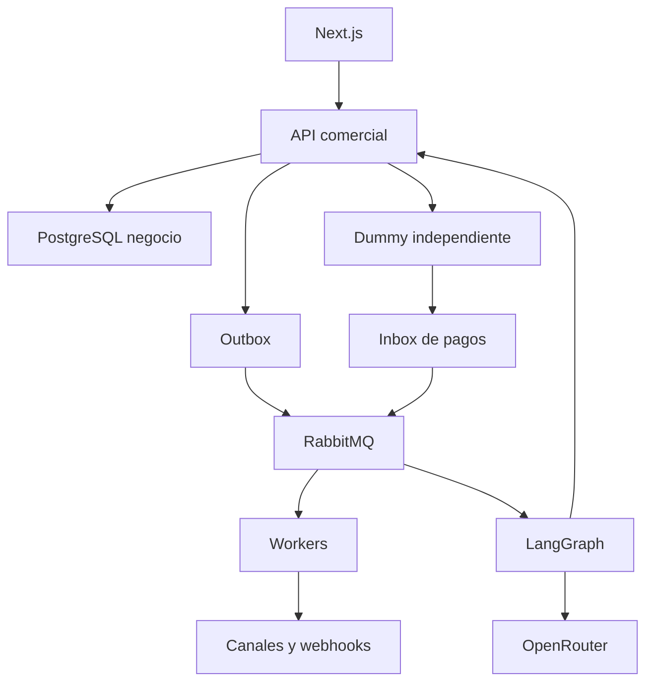

# SPEC-FND — Arquitectura, repositorio y contratos de base

Versión: 2.0. Estado: especificado; implementación pendiente.

## Límites de servicios

Monorepo `apps/web`, `apps/commerce-api`, `apps/commerce-worker`, `apps/agent-service`, `apps/dummy-gateway`; paquetes `contracts`, `ui`, `config`, `domain`; carpetas `specs`, `infra`, `tests/fixtures`, `tests/contract`, `tests/e2e`. Python conserva su lockfile y entorno propio; comparte JSON Schema, no importa TypeScript.

API comercial propietaria de sus tablas. Agente usa casos de uso HTTP autenticados. Dummy tiene base/esquema y usuario SQL separados, no tiene permisos para modificar pedidos. Next.js usa `/api/v1` bajo el mismo origen mediante reverse proxy; SSR llama a API con sesión del usuario, nunca con una credencial omnipotente.

Puertos internos Compose: web 3000, API 4000, agente 8000, dummy 4100, PostgreSQL 5432, RabbitMQ 5672 y object storage 9000. Solo reverse proxy publica 443 en ambiente desplegado; administración y puertos de datos no quedan públicos. No son puertos ya instalados: son valores de configuración propuestos.

## Contratos comunes

IDs UUIDv7 nuevos; ejemplos usan alias legibles solo en documentación. JSON camelCase; SQL snake_case. Dinero decimal string de dos decimales, cantidades string de tres; UTC RFC3339; enums en mayúsculas. JSON Schema/OpenAPI rechaza propiedades inesperadas en comandos. IDs opacos, nunca folios como FK. Respuestas `{data,requestId}`; listas `{data,page:{nextCursor,hasMore},requestId}`.

Error `{error:{code,message,fieldErrors,retryable},requestId}`. `fieldErrors` es array de `{path,message,code}`. 401 identidad, 403 scope, 404 recurso no accesible, 409 concurrencia/idempotencia, 422 regla, 429 cuota, 503 dependencia. Un job devuelve 202 y `{id,status,statusUrl}`.

Toda mutación comercial usa versión esperada cuando modifica una entidad existente; las creaciones y efectos externos usan `Idempotency-Key`. GET/HEAD no realizan transiciones comerciales. Los eventos incluyen schemaVersion, aggregateVersion, tenant, origin y livemode.

## Persistencia y ejecución

Transacción de negocio: validar → bloquear agregado → persistir → insertar outbox → commit. Publicador reclama filas con lease/`SKIP LOCKED`, publica con confirm y marca; crash puede duplicar publicación. Consumidor inbox deduplica y confirma al broker después de commit. No mantener una transacción SQL mientras se espera LLM, WhatsApp o dummy.

La cola separa `incoming`, `agent`, `notifications`, `integrations`, `payments`, `imports`. Mensajes contienen referencias mínimas, no el token público ni audios. El estado persistente permite reintentar tras reinicio. Cada proceso soporta apagado ordenado, health/readiness y correlación.

## Requisitos, tareas y aceptación

### REQ-FND-01 / T-FND-01 — Fijar repositorio y herramientas

**Regla normativa:** Todos los procesos arrancan desde una instalación reproducible.

**Trabajo específico:** Crear workspace pnpm, TypeScript strict, Python lockfile, scripts lint/typecheck/build/test y `.env.example` sin secretos. Resolver versiones compatibles Next/React/RHF/Zod/shadcn y fijar imágenes por versión/digest.

**Entregable esperado:** workspace, package.json, lockfiles, infra/compose.yaml y documento de versiones.

**Dependencias:** ninguna.

**AC-FND-01 — prueba de aceptación:** En checkout limpio, instalación con lockfiles y build de web/API/agente/dummy completan sin edición manual.

**Evidencia para cerrar:** cambio de código/contrato, prueba indicada y resultado reproducible vinculados a T-FND-01. Estado inicial: `TODO`.

### REQ-FND-02 / T-FND-02 — Crear contrato canónico

**Regla normativa:** API y herramientas derivan DTOs del mismo contrato versionado.

**Trabajo específico:** Convertir 17-contratos-api-eventos.md en OpenAPI 3.1 y JSON Schemas; generar tipos TS y modelos Python; validar ejemplos, required/nullability, errores y headers. Añadir prueba de drift de schemas.

**Entregable esperado:** packages/contracts/openapi.yaml, schemas y clientes generados.

**Dependencias:** T-FND-01.

**AC-FND-02 — prueba de aceptación:** Un campo requerido omitido y un campo desconocido fallan igual en API y cliente; todos los ejemplos canónicos validan.

**Evidencia para cerrar:** cambio de código/contrato, prueba indicada y resultado reproducible vinculados a T-FND-02. Estado inicial: `TODO`.

### REQ-FND-03 / T-FND-03 — Crear persistencia base

**Regla normativa:** Cada fila empresarial pertenece a un tenant y conserva auditoría temporal.

**Trabajo específico:** Implementar Prisma, migraciones SQL auxiliares, UUIDs, fechas, versión, relaciones compuestas tenant/id, usuarios DB por servicio y seed de dos tenants. Datos financieros nunca usan floats.

**Entregable esperado:** schema.prisma, migrations, seed y credenciales mínimas por servicio.

**Dependencias:** T-FND-02.

**AC-FND-03 — prueba de aceptación:** FK cruzada entre tenants falla; dummy no puede actualizar orders; monto 0.10 + 0.20 conserva 0.30.

**Evidencia para cerrar:** cambio de código/contrato, prueba indicada y resultado reproducible vinculados a T-FND-03. Estado inicial: `TODO`.

### REQ-FND-04 / T-FND-04 — Implementar inbox/outbox

**Regla normativa:** Un crash no pierde el cambio comercial ni duplica sus efectos al reentregar.

**Trabajo específico:** Crear outbox con status/lease/attempts, publicador RabbitMQ con confirms, inbox unique consumer/event, workers con ack posterior al commit y DLQ. Inyectar reloj para pruebas.

**Entregable esperado:** apps/commerce-worker/src/messaging y migraciones outbox/inbox.

**Dependencias:** T-FND-03.

**AC-FND-04 — prueba de aceptación:** Matar worker después del commit y antes de ack; al recuperar existe un único efecto y ningún evento perdido.

**Evidencia para cerrar:** cambio de código/contrato, prueba indicada y resultado reproducible vinculados a T-FND-04. Estado inicial: `TODO`.

### REQ-FND-05 / T-FND-05 — Implementar contexto y errores

**Regla normativa:** Tenant y principal vienen de credenciales verificadas, no del body.

**Trabajo específico:** Añadir RequestContext, correlation ID, exceptions filter, paginación cursor firmada y límites. Rechazar cursor de otra empresa y propagar contexto solo por cabeceras internas firmadas.

**Entregable esperado:** commerce-api/src/common/context, filters y pagination.

**Dependencias:** T-FND-04.

**AC-FND-05 — prueba de aceptación:** Intentar cambiar tenantId en JSON o cursor nunca cambia el alcance; error contiene requestId y no stack.

**Evidencia para cerrar:** cambio de código/contrato, prueba indicada y resultado reproducible vinculados a T-FND-05. Estado inicial: `TODO`.

### REQ-FND-06 / T-FND-06 — Crear almacenamiento y jobs

**Regla normativa:** Adjuntos y operaciones largas tienen acceso temporal y estados consultables.

**Trabajo específico:** Implementar ObjectStorage S3 compatible, key prefix tenant, upload intents con MIME/tamaño, finalize validado y jobs PENDING/RUNNING/SUCCEEDED/PARTIAL/FAILED. Añadir URLs temporales de descarga.

**Entregable esperado:** storage adapter, job module y fixtures de imagen/audio.

**Dependencias:** T-FND-05.

**AC-FND-06 — prueba de aceptación:** URL expirada o de otro tenant no descarga; job sobrevive reinicio y conserva progreso.

**Evidencia para cerrar:** cambio de código/contrato, prueba indicada y resultado reproducible vinculados a T-FND-06. Estado inicial: `TODO`.

## Nota de implementación — T-FND-04 (2026-09-07)

`apps/commerce-worker` ya no usa un consumidor stub. `InboxConsumer` declara
cola durable por `CONSUMER_GROUP` enlazada al exchange `netpay` con los
patrones de `CONSUMER_PATTERNS`, deduplica por el índice único
`(consumerGroup, eventId)` de `InboxEvent`, aplica el manejador registrado en
`src/handlers.ts` y reconoce el mensaje **después** de marcar `PROCESSED`. Un
evento sin `messageId`/tenant, con payload no JSON o cuyo manejador falla va a
`netpay.<grupo>.dlq` sin reintento en bucle; el reproceso es una decisión de
operación.

Variables: `CONSUMER_GROUP` (por defecto `commerce-worker`),
`CONSUMER_PATTERNS` (por defecto `#`), `CONSUMER_PREFETCH` (por defecto 10).
